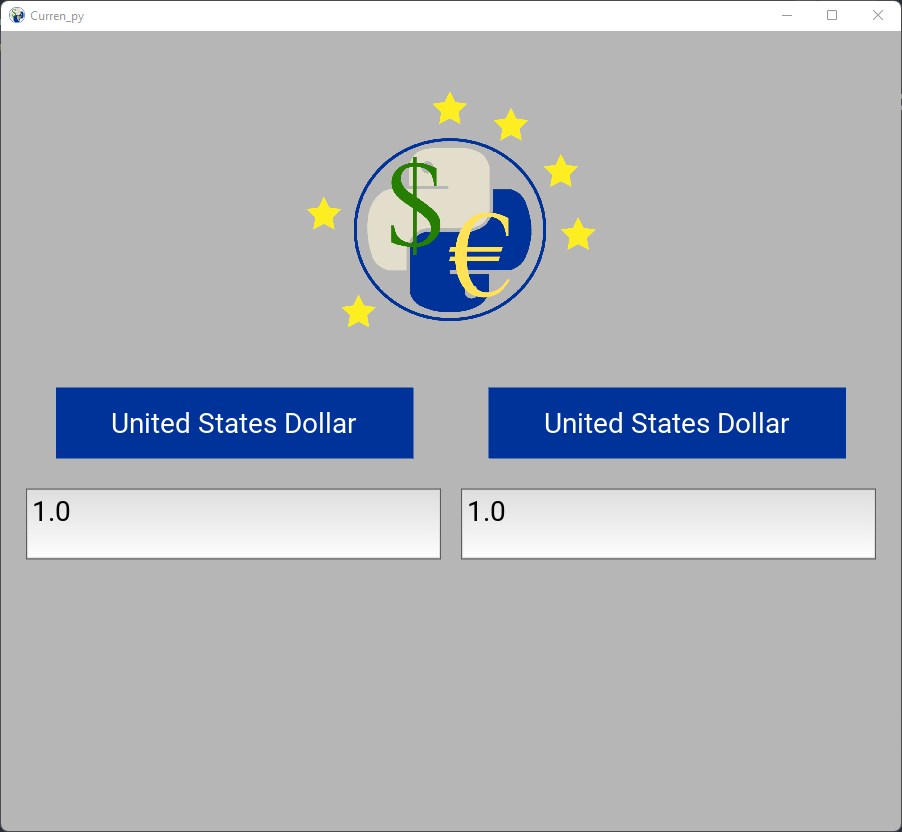
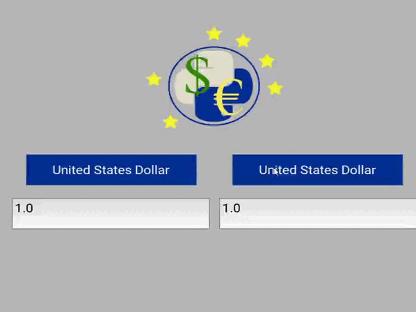

# Curren_py : A simple and lightweight currency converter application!

This application support more than 150 currencies thanks to the ExchangeRate-API.

Curren_py is easy to use and could serve as a good project for beginners in Kivy Design language and Kivy GUI framework. 
I personally feel that Kivy might be better for mobile development. 

However, its design language helped me a lot to shorten the number of code in my files.
Where PyQt framework (used for the first version) will definitely bring a professional look to your user interface but
with more code needed.

## How does it work ?

As simple as it looks like, there are only four inputs that will communicate automatically thanks to the event process:

- Two "Spinners" that work as dropdown menus, in which we can select any of the currently supported currencies.
- Two "text inputs" in which can be written float numbers only.

## Credits

For this project, I must give credits to ExchangeRate-API for there work and for its free access. I also want to
highlight the original tutorial named "Currency Converter in Python" from Data Flair website.

Finally, this application use requirements that you can check below:

- Kivy~=2.1.0
- requests~=2.27.1

## Ways to improve
The best way to improve this application is to make it for mobile by using Kivy GUI Framework and KivyMD.